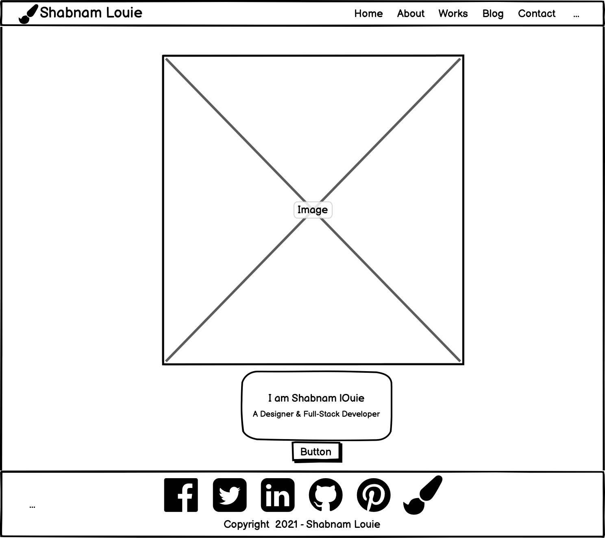
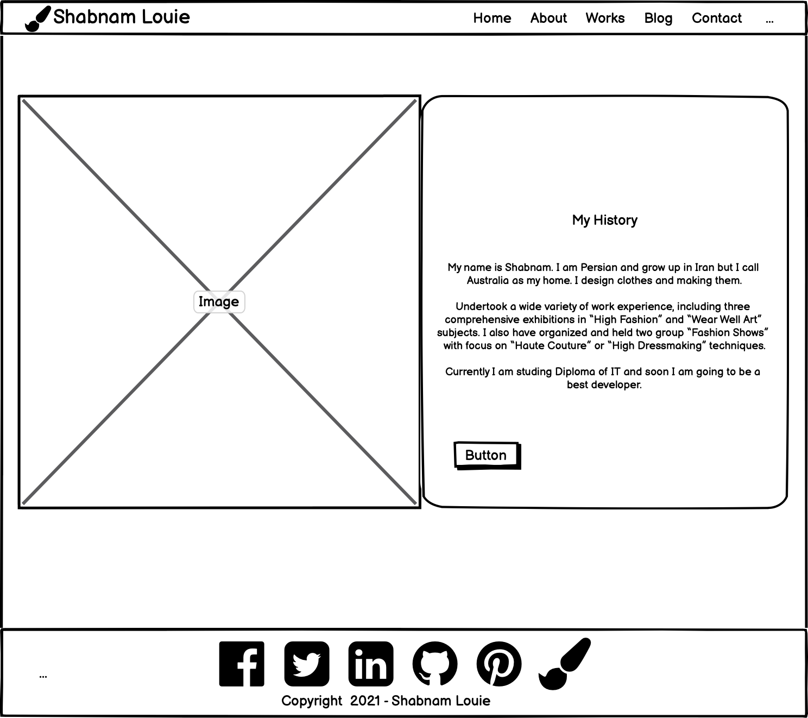
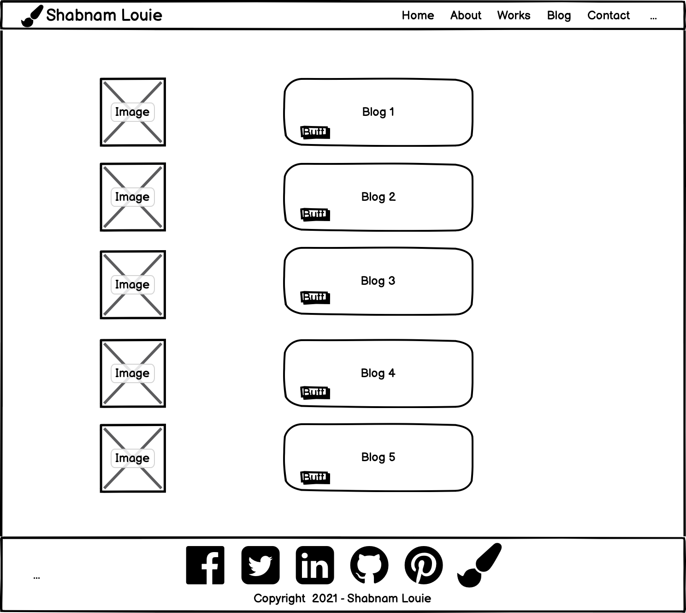
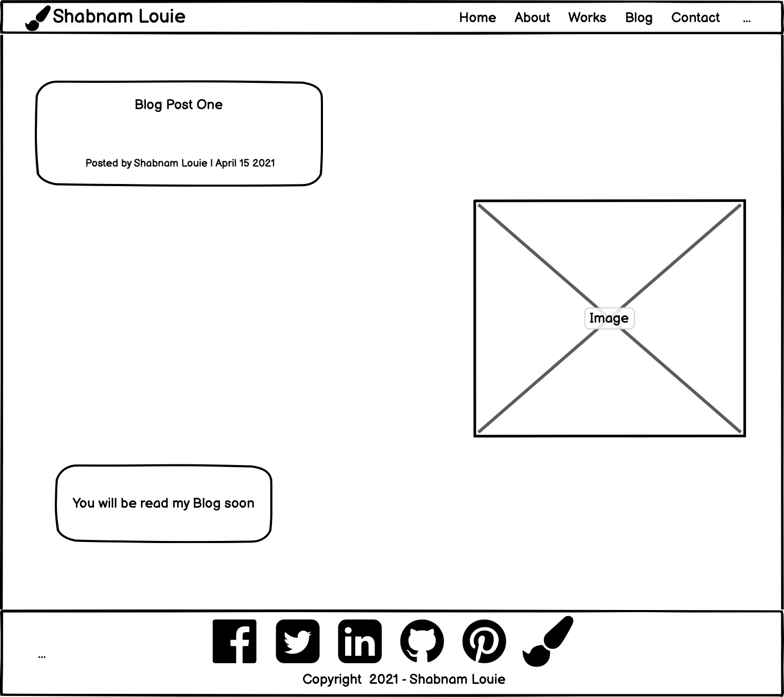
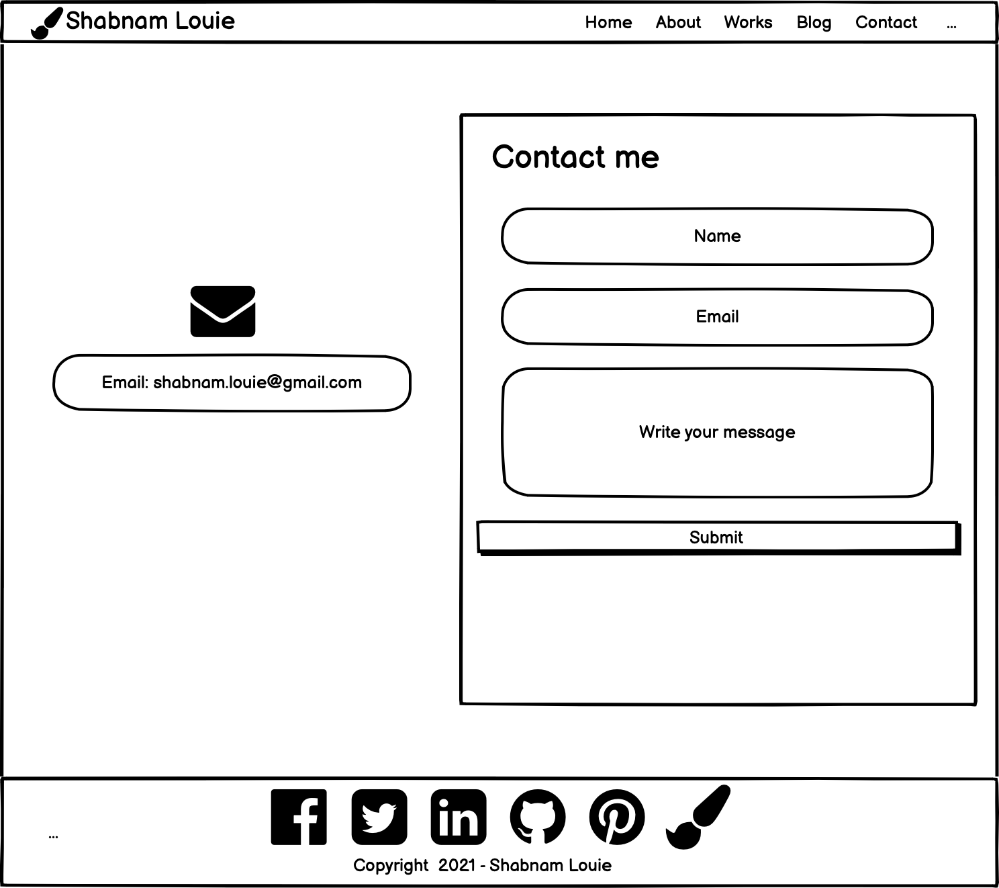
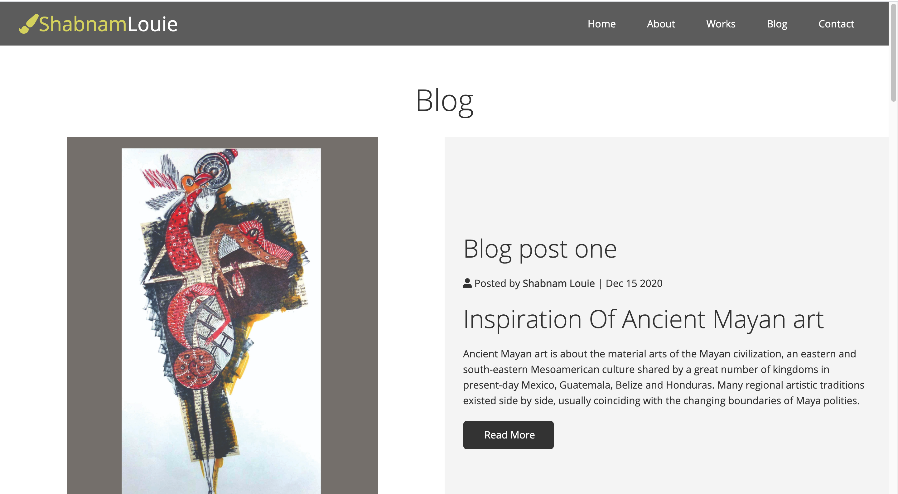
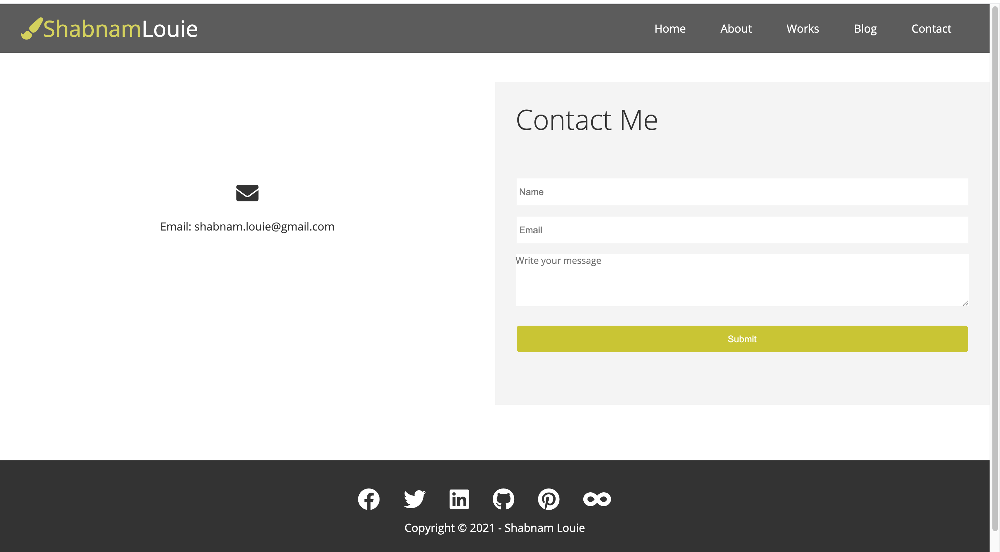

[This is my Website](https://shabnamlouie.netlify.app/)

[This is my GitHub repo](https://github.com/shabnamlouie/my-second-portfolio)

## Description and purpose of my portfolio website:

I make my first website according to one of my subject which, I am studying as a Diploma in IT at Coder academy college.

## Functionality: 

I design my website’s pages in Balsamiq wireframe app.
I design site map for my website.
Then according to my design, I wrote HTML & CSS codes in visual studio code.
### For This website I make some pages such as: 
Home ,
About ,
Works ,
Blog ,
Contact ,
So you can navigate to other pages.

## Sitemap:

## Home:

## About:

## Works:

## Blog:

## Post:

## Contact:

## Screen shots of pages:

## Target Audience:
Target audience for my website is mainly my classmate and techers to see how much I progress I had since I start my course.

## Tech stack:
I made my portfolio website through visual studio and also, I made a git repository on my github then, after each changes I pushed my files to github and then git pull them to have them back.
Finally, I deploy my website into Netlify.